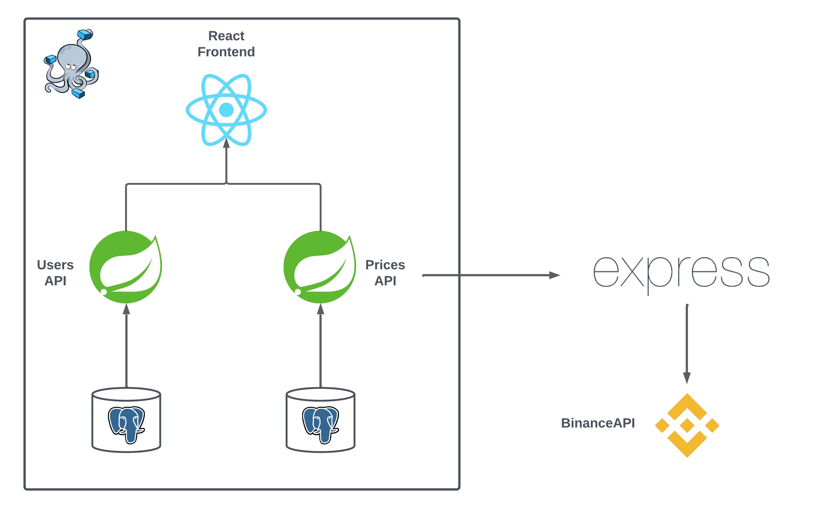

# CryptoMynce

CryptoMynce is a cryptocurrency trading application focused on the educational sector. In this platform, students can make transactions with a wide range of crypto-assets, and teachers can easily leave feeback about these transactions.

A diverse stack of modern technologies and tools has been employed to create this project, with a special emphasis on maintaining a highly professional workflow, utilizing development practices such as CI and CD. The Frontend has been constructed using React, while the Backend has been developed with the Spring Boot framework. In addition to these core technologies, others such as Docker, Vite, and Github Actions have also been used.

### Arquitecture

The Frontend of the app was developed with React.
The backend of the application consists of three APIs: UsersAPI manages user information in a PostgreSQL database, PricesAPI stores and retrieves cryptocurrency data using the Binance API as the main source. These APIs are orchestrated through Docker Compose for streamlined deployment. Additionally, a third API, developed in Express, was created due to legal and regulatory restrictions imposed by Binance in the United States, where the main server is located. This API is deployed on a European server to overcome these limitations and provide necessary information to PricesAPI.

### Screenshots

